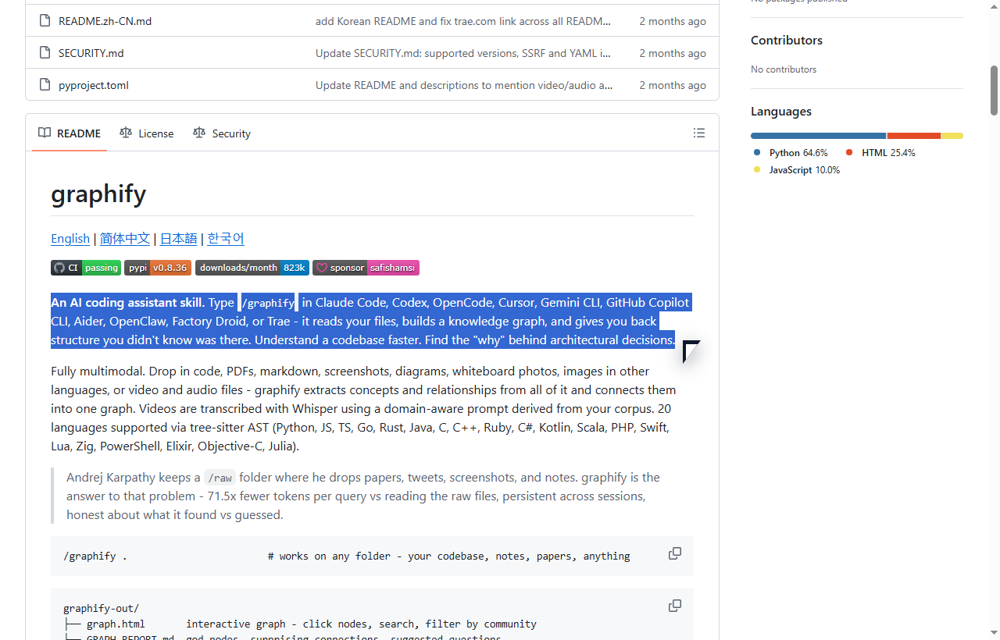
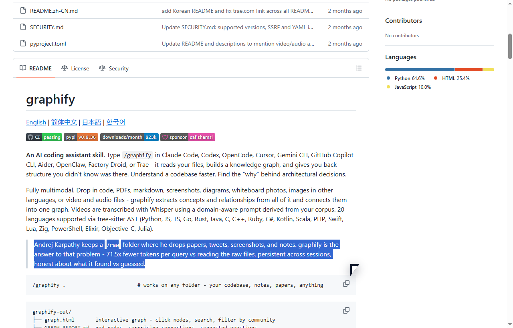
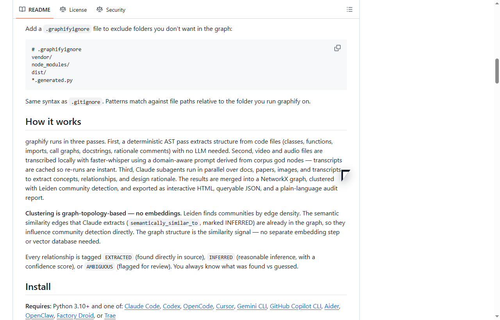

# graphify Native Selection Proof

这条视频不是 staged creator cut，而是直接录 GitHub 页面上的真实鼠标动作、浏览器缩放和原生蓝色选区。

- 视频：`recordings/graphify-live-selection-proof.mp4`
- 页面：`https://github.com/kenchikuliu/graphify`
- 总时长：`43.9s`
- 步骤数：`3`

## 1. Repo Thesis

- 时间：1.0s - 15.0s
- 选区：x=70, y=391, w=808, h=48
- 说明：我先圈这句，因为它把 graphify 的价值说得很直白：不是继续堆上下文，而是先还原结构。

## 2. Compression Proof

- 时间：15.0s - 27.9s
- 选区：x=70, y=615, w=808, h=48
- 说明：这一段适合做 hook。它不是抽象理念，而是直接把收益压到一句话里。

## 3. Three Passes

- 时间：27.9s - 41.4s
- 选区：x=70, y=374, w=808, h=64
- 说明：真正该放大的不是功能清单，而是这段机制说明。三段式流程决定它到底是不是工具链，而不只是可视化外壳。

