# graphify Creator Cut 拆镜头稿

这个文件把最终视频按镜头拆开，方便继续改成图文博客、社媒长图文，或者二次录屏脚本。

- 视频：`recordings/graphify-real-demo-cut.mp4`
- 长文：`graphify-real-demo-blog.md`
- 配音：`elevenlabs`
- 总时长：`01:24`（约 84.4 秒）
- 镜头数：`7`
- 原生浏览器 proof：`recordings/graphify-live-selection-proof.mp4`（约 43.8 秒）
- 原生 proof 页面：`graphify-live-selection-proof.html`
- 原生 proof 步骤：`4`

## 1. AI 读大项目缺的不是更长上下文

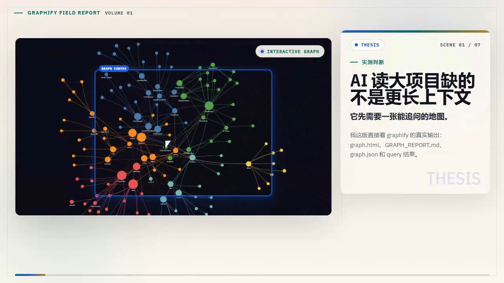

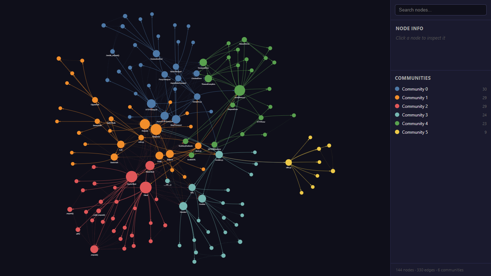

- 时间：00:00 - 00:09
- Kicker：实测判断
- Subtitle：它先需要一张能追问的地图。
- Caption：我这版直接看 graphify 的真实输出：graph.html、GRAPH_REPORT.md、graph.json 和 query 结果。
- 博客正文优先截图：screenshots/01-graph-html.png
- 旁白：这一版我不再复述 README，直接看 graphify 的真实输出。我的判断是：AI 读大项目迷路，不一定是上下文不够，它先需要一张能追问的地图。

## 2. 我只认这四个产物

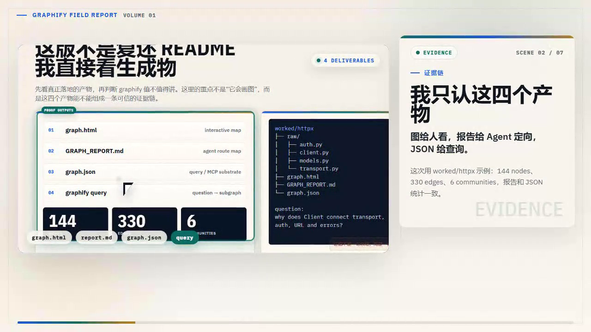

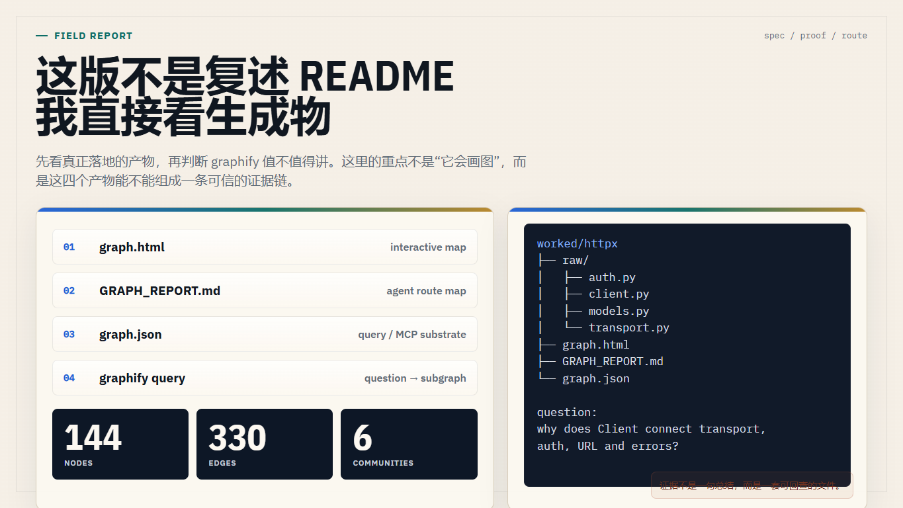

- 时间：00:09 - 00:24
- Kicker：证据链
- Subtitle：图给人看，报告给 Agent 定向，JSON 给查询。
- Caption：这次用 worked/httpx 示例：144 nodes、330 edges、6 communities，报告和 JSON 统计一致。
- 博客正文优先截图：screenshots/02-output-proof.png
- 旁白：我只认这四个产物。graph 点 html 给人点开看，GRAPH_REPORT 点 md 给 Agent 定向，graph 点 json 作为查询底座，再加一条 graphify query 的结果。这个 httpx 示例是 144 个节点，330 条边，6 个社区。

## 3. GRAPH_REPORT.md 像一张读项目路线图

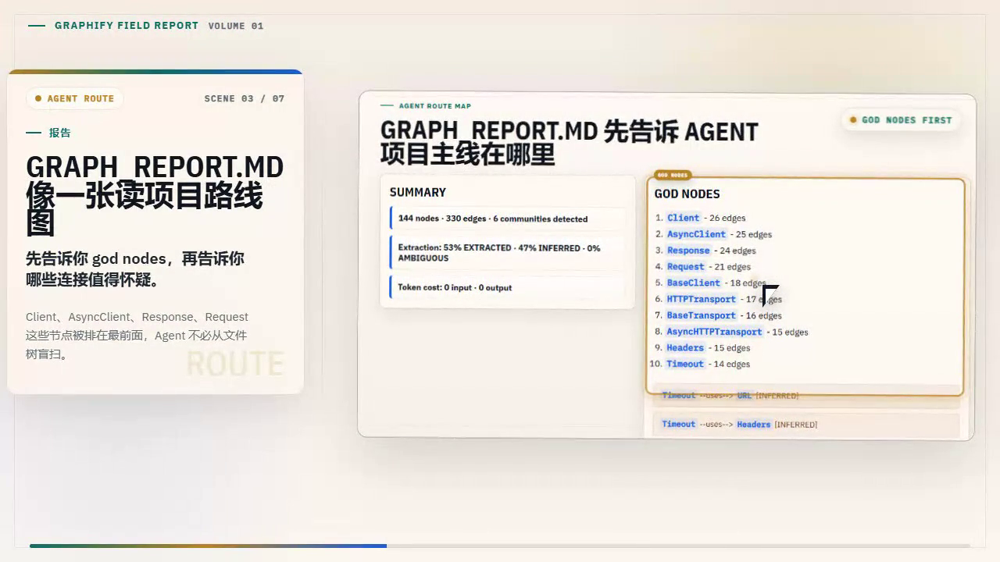

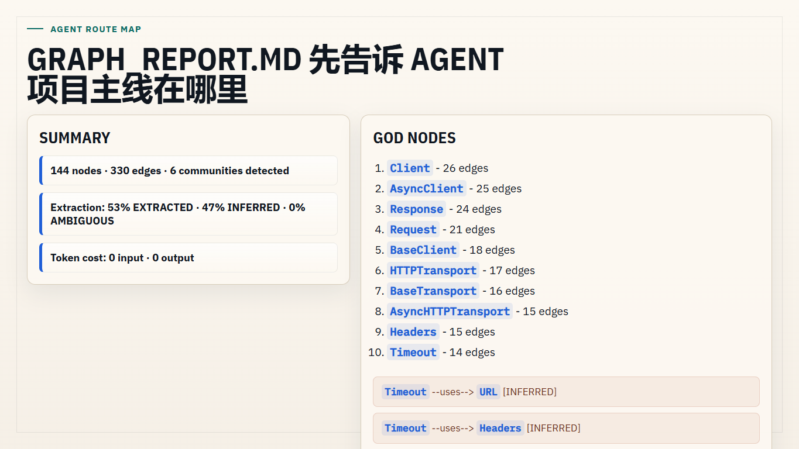

- 时间：00:24 - 00:37
- Kicker：报告
- Subtitle：先告诉你 god nodes，再告诉你哪些连接值得怀疑。
- Caption：Client、AsyncClient、Response、Request 这些节点被排在最前面，Agent 不必从文件树盲扫。
- 博客正文优先截图：screenshots/03-report-proof.png
- 旁白：GRAPH_REPORT 点 md 最适合给 Agent 先读。它先把 god nodes 排出来，Client、AsyncClient、Response、Request 都在前面。也就是说，Agent 不必从文件树盲扫，而是先知道架构主线在哪里。

## 4. graph.html 不是装饰图

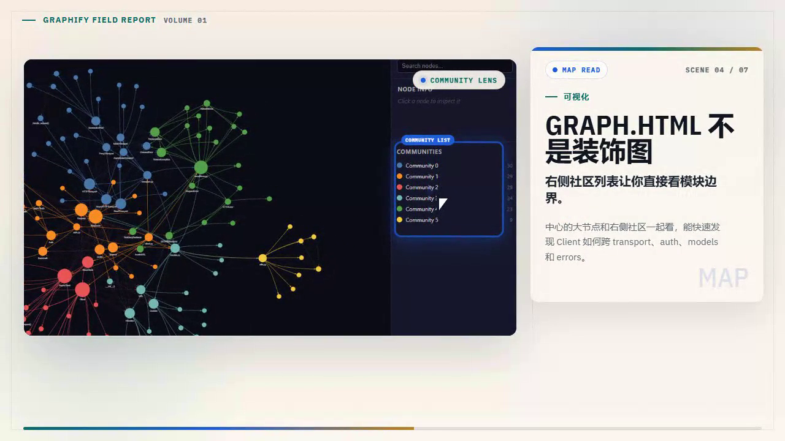

- 时间：00:37 - 00:50
- Kicker：可视化
- Subtitle：右侧社区列表让你直接看模块边界。
- Caption：中心的大节点和右侧社区一起看，能快速发现 Client 如何跨 transport、auth、models 和 errors。
- 博客正文优先截图：screenshots/01-graph-html.png
- 旁白：graph 点 html 也不是装饰图。你看右侧社区列表，再看中心的大节点，就能很快发现 Client 是怎么跨 transport、auth、models 和 errors 的。这个画面比单纯看目录更像地图。

## 5. query 返回的是子图，不是一句漂亮摘要

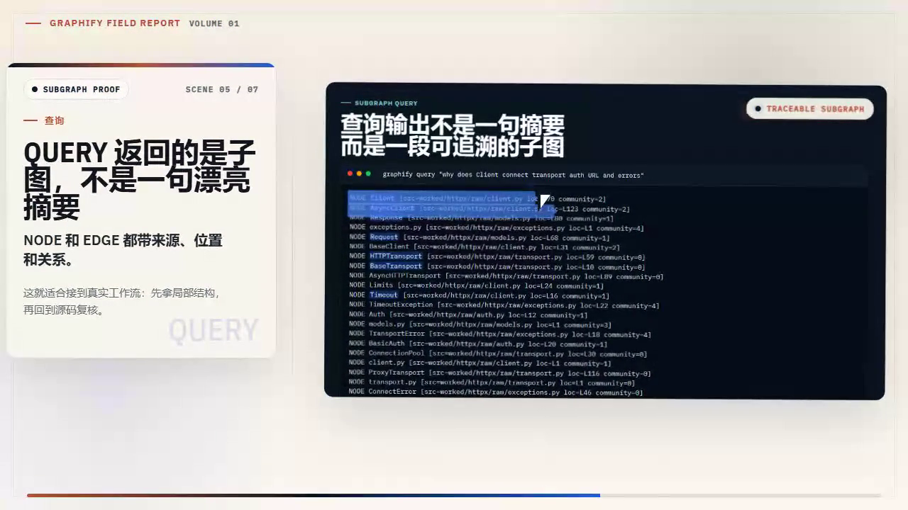

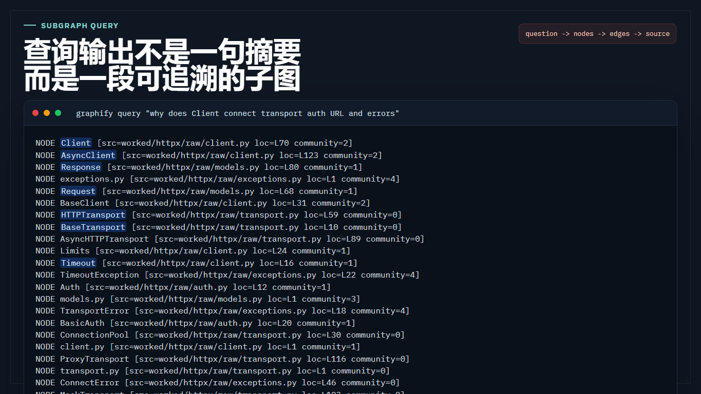

- 时间：00:50 - 01:01
- Kicker：查询
- Subtitle：NODE 和 EDGE 都带来源、位置和关系。
- Caption：这就适合接到真实工作流：先拿局部结构，再回到源码复核。
- 博客正文优先截图：screenshots/04-query-client.png
- 旁白：更关键的是 query。它返回的不是一句漂亮摘要，而是一段子图。NODE 有来源文件和行号，EDGE 有关系和置信标记。真实工作流里，你可以先拿局部结构，再回到源码复核。

## 6. 关系有置信度，才方便复核

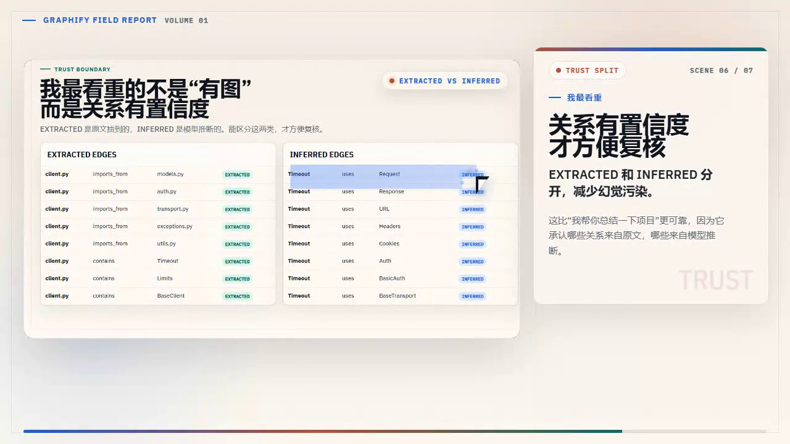

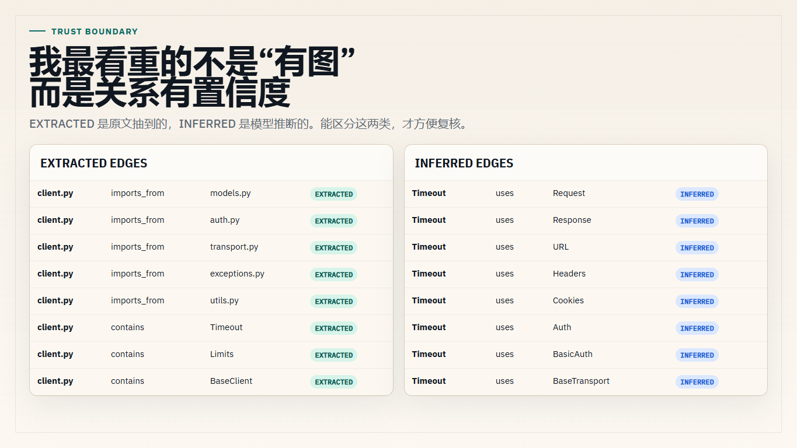

- 时间：01:01 - 01:12
- Kicker：我最看重
- Subtitle：EXTRACTED 和 INFERRED 分开，减少幻觉污染。
- Caption：这比“我帮你总结一下项目”更可靠，因为它承认哪些关系来自原文，哪些来自模型推断。
- 博客正文优先截图：screenshots/05-confidence.png
- 旁白：我最看重的是置信度。EXTRACTED 是原文抽到的，INFERRED 是模型推断的。一个工具愿意把这两类分开，才适合给 AI assistant 用，因为你知道哪些地方需要复核。

## 7. 这篇就按“实测证据链”来写

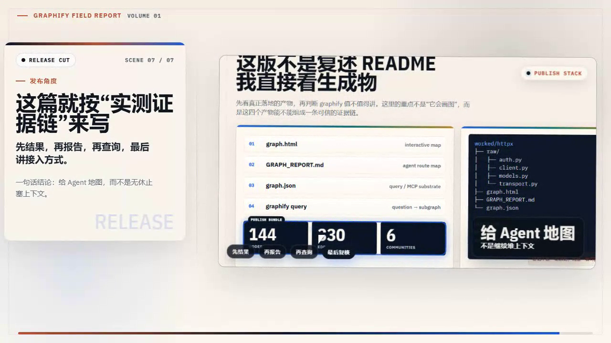

- 时间：01:12 - 01:24
- Kicker：发布角度
- Subtitle：先结果，再报告，再查询，最后讲接入方式。
- Caption：一句话结论：给 Agent 地图，而不是无休止塞上下文。
- 博客正文优先截图：screenshots/02-output-proof.png
- 旁白：所以这篇图文和视频，我会按实测证据链来写：先看结果，再看报告，再看查询，最后讲怎么接到 Agent 工作流。结论就一句话：给 Agent 地图，而不是无休止塞上下文。

